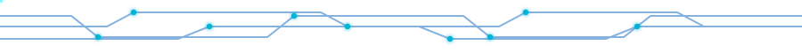

<!--
  ⚙️  fmfs — GitHub Profile README
  ─────────────────────────────────────────
  SETUP (one time):
   1. Repo name MUST equal your username:  github.com/fmfs/fmfs
   2. Commit divider.svg into an /assets folder at the repo root
      (path used below: assets/divider.svg)
   3. Fill in the LinkedIn / email / portfolio links in the "Connect" section.
-->

<div align="center">

<!-- ░░ ANIMATED HEADER BANNER ░░ -->


<!-- ░░ TYPING SUBTITLE ░░ -->
[](https://github.com/fmfs)

<!-- ░░ QUICK BADGES ░░ -->


<!-- ░░ CIRCUIT DIVIDER ░░ -->


</div>

<!-- ░░ ABOUT ░░ -->
## ⚡ whoami

```c
struct FahimFaisal {
    char  *role     = "EEE Undergraduate @ SUST, Sylhet";
    char  *building = "Robots, PCBs & embedded firmware";
    char  *stack[]  = {"STM32", "Arduino", "Raspberry Pi", "C/C++", "Python"};
    char  *learning = "Edge ML on microcontrollers";
    bool   coffee   = true;   // always
};
```

> I live at the intersection of **hardware and code** — soldering iron in one hand, debugger in the other. I design the board, route the traces, flash the firmware, and make the thing *actually work*.

<div align="center">


## 🔌 Embedded Systems


&nbsp;


<br><br>


## 🟩 PCB & Hardware Design


## 🛠️ Tools & Software


<br><br>


## 🚀 Areas of Expertise


## 📊 GitHub Stats


<br>


<br><br>


<br>


## 🌐 Let's Connect

<!-- replace the # with your real links -->
<a href="#"></a>
<a href="#"></a>
<a href="#"></a>

<br><br>

<!-- ░░ FOOTER WAVE ░░ -->


</div>
